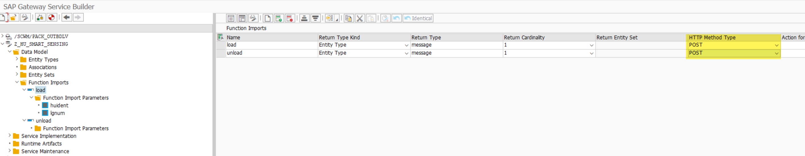
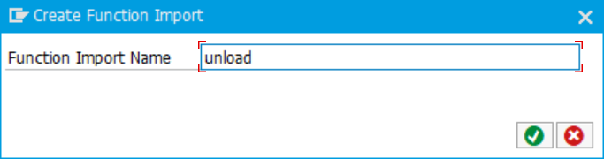
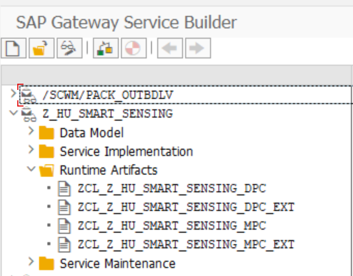
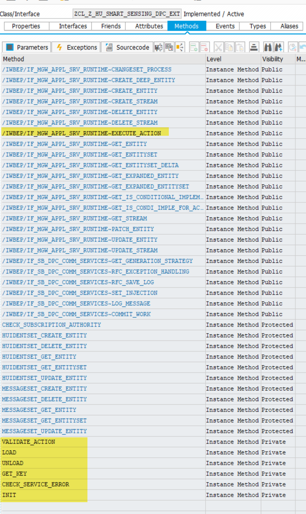

# Load and Unload, SAP Internet of Things

## How to Load and Unload Process with SAP IoT System

* [General](#general)

* [Prerequisites](#prerequisites)

* [Create ODATA service](#create-odata-service)

  + [Create Entity Types](#create-entity-types)

  + [Create Function Imports](#create-function-imports)

  + [Generate ODATA Services Class](#generate-odata-services-class)

* [Register services](#register-services)

* [Development](#development)

* [Test](#test)

# General

The Purpose of this sample is to set up an ODATA service for the SAP Internet of Things to Load and Unload Handling Units.

# Prerequisites

-   The naming are case sensitive

# Create ODATA service

A new project needs to be created in the ODATA services by transaction
(TC) SEGW.

Add a project name and description

## Create Entity Types

After the project has been created, the next step is to create a entity
type. It is a advice to use already existing structures or create an own
structure and import it into the entity type.

For the Load/Unload Process import the structure /SCWM/S_HUIDENT:

Choose the fields LGNUM and HUIDENT to be imported into the entity type.

Add the Key flag for both entries and finish the creation.

Adding another structure for the messaging.

Select the standard structure /SCWM/S_ODATA_MESSAGE

Choose the fields MSG_SUCCESS, MSGID, MSGNO, MESSAGE, HUIDENT and LGNUM
to be imported into the entity type.

Add the Key flag for the fields MSGID, MSGTY, HUIDENT and LGNUM and
finish the creation.

## Create Function Imports

### LOAD

The next step is to create function imports for loading and unloading.
Select the data model and create via wizard:

Add a function import name *load*

The settings for the function import have to be chosen. The return type
kind has to be selected “Entity Type” and the return type has to be
message. The Return Cardinality must be 1. The HTTP Method type must be
POST.

For the function import, the parameters must be entered with huident and
lgnum. Both fields need to be mapped to the correct ABAP field name.

###  UNLOAD

Creation of next function import unload:

Add a function import name *unload*

The settings for the function import have to be chosen. The return type
kind has to be selected “Entity Type” and the return type has to be
message. The Return Cardinality must be 1. The HTTP Method type must be
POST.

For the function import, the parameters must be entered with huident and
lgnum. Both fields need to be mapped to the correct ABAP field name.

## Generate ODATA Services Class

Generated classes are included:

# Register services

Open TC /IWFND/MAINT_SERVICE to register the new service. Add a new
Service:

Search with LOCAL the created ODATA service:

Select the technical service and ad service:

Add Name and package. Create the new service

# Development

Start the workbench with TC SE80 and select the package, which the ODATA
service classes are generated. Always redefine methods in class with
\*DPC_EXT. Redefine the method
/IWBEP/IF_MGW_APPL_SRV_RUNTIME\~EXECUTE_ACTION. This method will be
called when a function import is executed.

Add following coding:

Creating Exception class:

# Test

