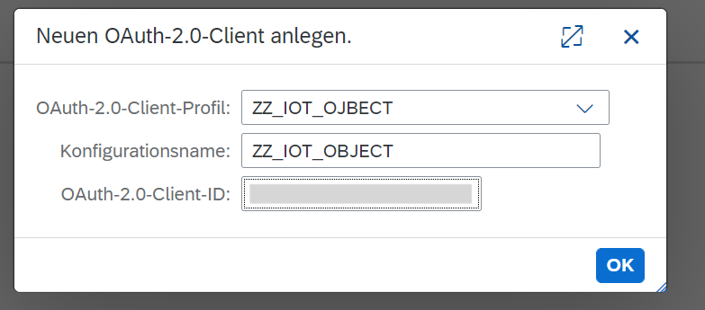
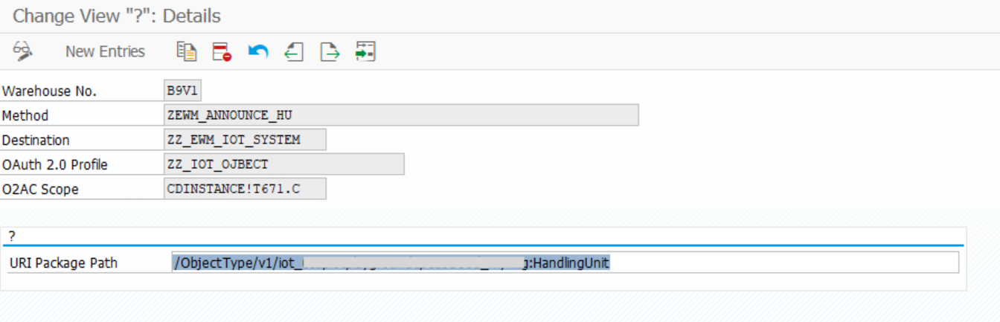
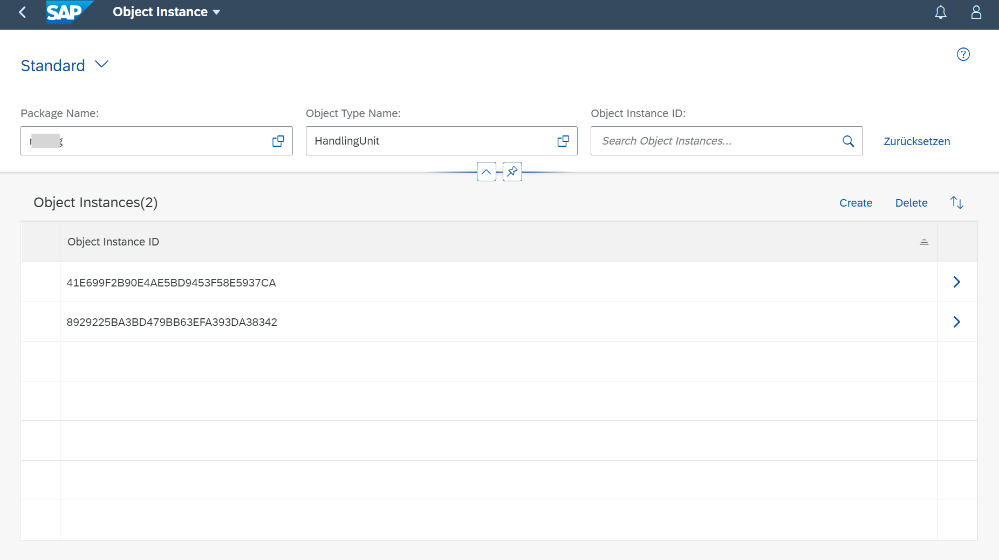

# Push HUs, SAP Internet of Things

## Announce Handling Units to SAP IoT during Inbound Process

* [General](#general)

* [Prerequisites](#prerequisites)

* [Settings](#settings)

    + [Creation of a Profile for the IoT Connection](#creation-of-a-profile-for-the-iot-connection)

    + [Configuration of the OAuth Client](#configuration-of-the-oauth-client)

    + [PPF Action](#ppf-action)

    + [Settings for the Service](#settings-for-the-service)

* [Creation of Objects](#creation-of-objects)

    + [Dictionary Objects](#dictionary-objects)

    + [Class Libraries](#class-libraries)

* [Test](#test)

# General

Sample to announce the creation of new EWM Inbound Process Handling Units SAP Internet of Things. The sample, after the creation of new Handling Units in EWM, is invoking the SAP IoT Custom Master Data APIs to create new Object Instances representing the HUs.

# Prerequisites

-   The naming are case sensitive

# Settings

## Creation of a Profile for the IoT Connection

Create an OAuth Profile for the Token generation. A scope is needed if a
special handling of the service in the IoT system is needed

## Configuration of the OAuth Client

To connect to a IoT system, a client needs to be created. Call
transaction OA2C_CONFIG

Create a client with the created profile. Add the client ID into the
client:

After the creation, the attribute of the service needs to be inserted.
Insert the Client Secret, the authorization points and the toke point.
The access settings needs to be Basic, Header field and Client
Credentials

## PPF Action

The correct Actions profile needs to be selected for the PPF. For our
purpose we used the standard /SCWM/PDI_01:

Based on the requirements, the settings can be variable. We would
recommend to not start the PPF action in dialogue manually:

Subsequently, the processing method needs to be selected. Create a
method call and add a new custom entry:

To distinguish between actions, an own method should be selected for the
announcement. If a deletion is needed, that should be done in a
different method:

A custom class needs to be created at that point. An example coding is
included in this document:

It is also recommended to implement a scheduler:

## Settings for the Service

The PPF will be executed only, if the settings are done for the action.
Therefore, a custom view needs to be implement:

With theses settings, the creation of the HUs in the IoT system will be
triggered by the PPF.

# Creation of Objects

## Dictionary Objects

### Database Table

### View

### Table Type

### Structure

### Data Elements

### Domain

## Class Libraries

### Classes of PPF Action

#### Class

[ZCL_IM_EWM_IOT_SERVICE_class.abap](./ZCL_IM_EWM_IOT_SERVICE_class.abap)

#### Methods

[ANNOUNCE_HU_TO_IOT.abap](./ANNOUNCE_HU_TO_IOT.abap)

[ZCL_IM_EWM_IOT_SERVICE.abap](./ZCL_IM_EWM_IOT_SERVICE.abap)

### Classes for Service

#### Class

[ZEWM_CL_IOT_ANNOUNCE_SRVC.abap](./ZEWM_CL_IOT_ANNOUNCE_SRVC.abap)

#### Methods

[ANNOUNCE_PDI_HU.abap](./ANNOUNCE_PDI_HU.abap)

[GET_NAME_MAPPING_ANNOUNCE.abap](./GET_NAME_MAPPING_ANNOUNCE.abap)

[SENDING_IOT_SERVICE.abap](./SENDING_IOT_SERVICE.abap)

# Test

Packing 2 HUs of the inbound delivery 410000013800:

After Save, the PPF will run and create HUs in SAP IoT

PPF was successful:

New entries in SAP IoT:

